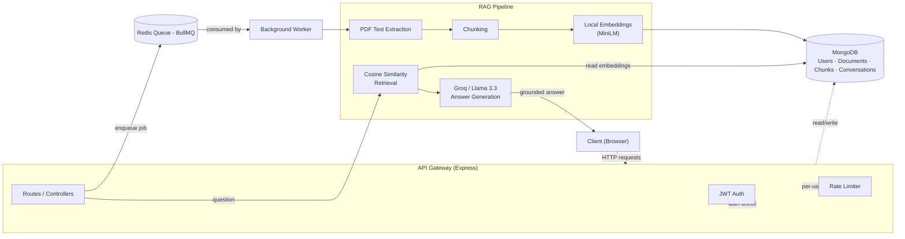

# 📖 DocSage

**An event-driven, AI-powered document Q&A gateway.** Upload documents, ask questions in plain English, and get accurate answers grounded in your own content — with source citations, conversation memory, and production-style backend infrastructure.


---

## 🎯 What This Is

DocSage lets a user upload a PDF and ask natural-language questions about it. Instead of relying on an LLM's general knowledge (which can hallucinate or simply not know your private documents), DocSage uses **Retrieval-Augmented Generation (RAG)**: it retrieves the exact relevant passages from your documents first, then asks the AI to answer using *only* that retrieved context.

On top of the AI core, DocSage is wrapped in a real **API Gateway layer** — the same category of infrastructure production systems use to protect and manage services: authentication, per-user rate limiting, event-driven background processing, and centralized error handling.

---

## 🖼️ Screenshots

<!-- Add your actual screenshots here — drag the image files into this repo's
     README editor on GitHub, or place them in a /docs/screenshots folder and
     reference them like:  -->

| Login | Chat Interface |
|---|---|
| *(screenshot here)* | *(screenshot here)* |

---

## 🏗️ Architecture



**Why event-driven?** Uploading a document triggers text extraction and embedding generation — work that can take several seconds. Instead of blocking the HTTP request, the API publishes a job to a Redis queue (BullMQ) and responds immediately. A **separate worker process** consumes jobs independently, meaning the API stays responsive regardless of processing load, and workers can scale independently of the API layer.

---

## ⚙️ Tech Stack

| Layer | Technology |
|---|---|
| API Framework | Node.js, Express |
| Authentication | JWT, bcrypt |
| Database | MongoDB, Mongoose |
| Job Queue | Redis, BullMQ |
| Rate Limiting | Redis (rate-limiter-flexible) |
| PDF Parsing | pdf-parse |
| Embeddings | @xenova/transformers (local, MiniLM-L6-v2, 384-dim) |
| LLM | Groq API (Llama 3.3 70B) |
| Containerization | Docker, Docker Compose |
| Frontend | Vanilla HTML/CSS/JS |

---

## ✨ Features

- 🔐 JWT authentication with bcrypt password hashing
- 📄 PDF upload with validation (type, size limits)
- ⚙️ Event-driven background processing (Redis + BullMQ + standalone worker)
- 🧠 Local embedding generation — no per-request API cost
- 🔍 Cosine-similarity retrieval across all of a user's documents
- 💬 Conversation memory — follow-up questions understand prior context
- 📌 Source citations on every answer (document + chunk + similarity score)
- 🛡️ Per-user rate limiting (Redis-backed)
- 🐳 Fully containerized with Docker Compose (API, worker, MongoDB, Redis)
- ⚠️ Graceful handling of non-extractable documents (e.g. scanned images) — flagged as `failed` rather than silently succeeding

---

## 📡 API Reference

### Auth

| Method | Endpoint | Description |
|---|---|---|
| POST | `/auth/signup` | Register a new user |
| POST | `/auth/login` | Authenticate, returns JWT |
| GET | `/auth/me` | Get current user (requires auth) |

### Documents

| Method | Endpoint | Description |
|---|---|---|
| POST | `/documents/upload` | Upload a PDF (multipart/form-data, field: `file`) |
| GET | `/documents` | List current user's documents |
| GET | `/documents/:id/status` | Check a document's processing status |

### Chat

| Method | Endpoint | Description |
|---|---|---|
| POST | `/chat/ask` | Ask a question. Body: `{ question, conversationId? }` |

**Example response from `/chat/ask`:**
```json
{
  "conversationId": "6a6088b4d47c6ebbc1ffc7a1",
  "answer": "This person has worked on two projects...",
  "sources": [
    { "documentId": "...", "chunkIndex": 0, "similarityScore": 0.159 }
  ]
}
```

---

## 🚀 Getting Started

### Option A — Docker Compose (recommended)

```bash
git clone https://github.com/Sejal-07661/docsage-gateway.git
cd docsage-gateway
cp .env.example .env   # fill in JWT_SECRET and GROQ_API_KEY
docker compose up --build
```

This starts four containers: the API, the background worker, MongoDB, and Redis.

### Option B — Local development

```bash
git clone https://github.com/Sejal-07661/docsage-gateway.git
cd docsage-gateway
npm install
cp .env.example .env   # fill in MONGO_URL, REDIS_URL, JWT_SECRET, GROQ_API_KEY

# Terminal 1
npm run dev

# Terminal 2 (required — this is what makes processing event-driven)
node worker.js
```

Then open **http://localhost:5000** in your browser.

---

## 🔑 Environment Variables

```env
MONGO_URL=mongodb://localhost:27017/docsage
REDIS_URL=redis://localhost:6379
JWT_SECRET=your_secret_key
GROQ_API_KEY=your_groq_api_key
PORT=5000
```

---

## 🔮 Roadmap

- [ ] OCR support for scanned/image-based PDFs
- [ ] Hybrid search (vector + keyword) with re-ranking
- [ ] Streaming answers (WebSocket, token-by-token)
- [ ] Multi-format support (Word, PPT)
- [ ] Automated test suite + CI pipeline
- [ ] Live deployment

---

## 👩‍💻 Author

**Sejal** — [GitHub](https://github.com/Sejal-07661)
