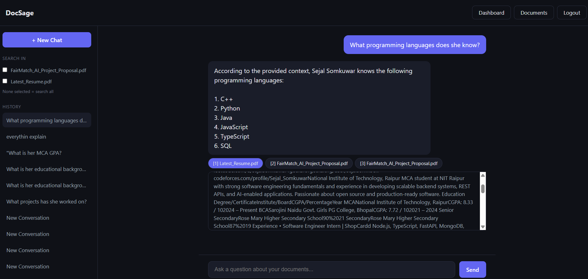
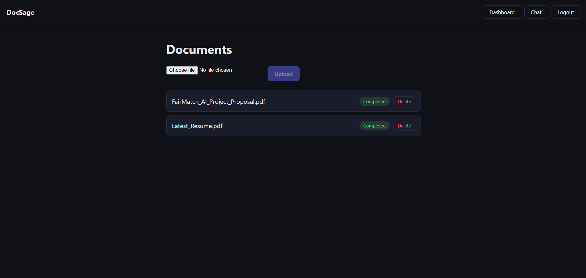
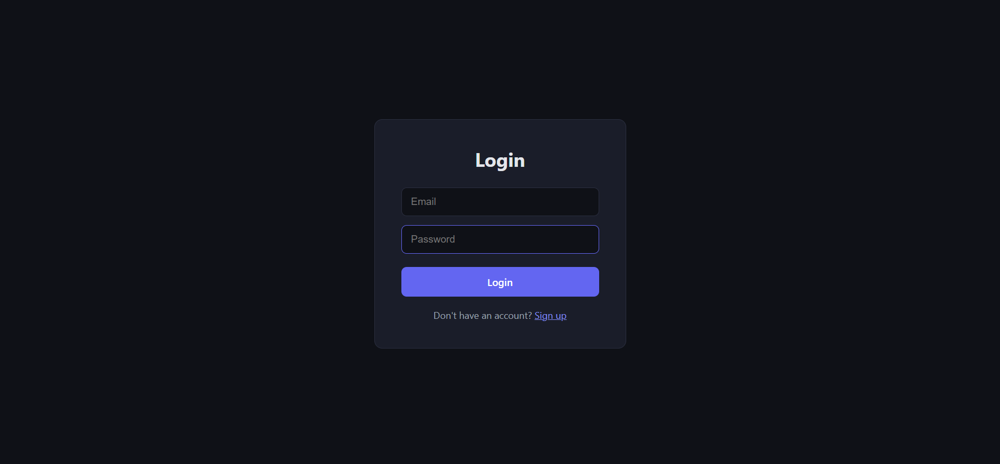
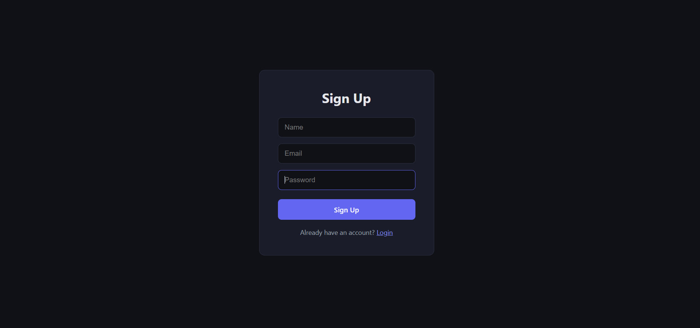
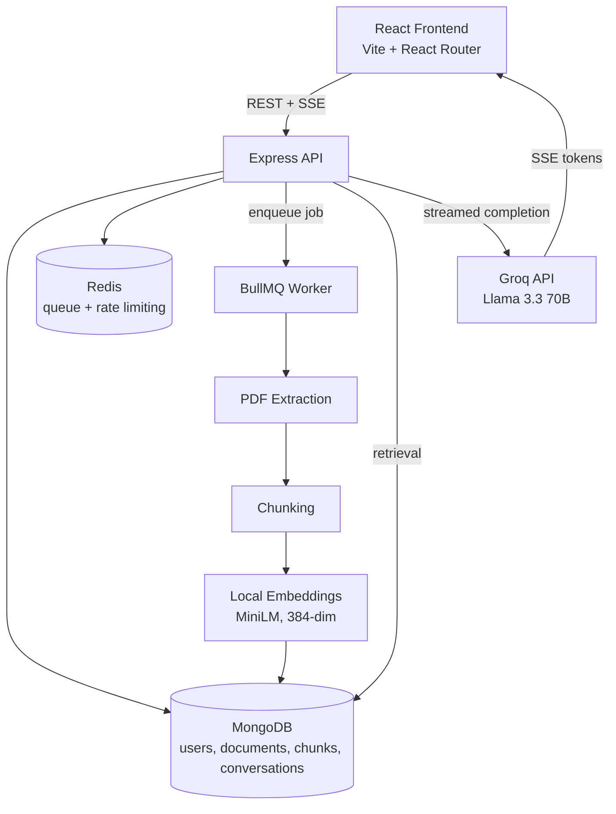

# DocSage — AI Document Intelligence Platform

DocSage is a full-stack, event-driven RAG (Retrieval-Augmented Generation) application that lets you upload documents and have a real-time, streaming conversation with an AI assistant grounded in their content — complete with clickable source citations and multi-document scoped search.

Built as an original portfolio project to demonstrate backend systems design, applied AI/RAG engineering, and full-stack product thinking.

**Live demo:** _(add link once deployed)_
**Repo:** https://github.com/Sejal-07661/docsage-gateway

---

## What it does

- Upload PDF documents and ask natural-language questions about their content
- Get answers that **stream in token-by-token**, like a real AI chat product
- Every answer includes **clickable citations** — click a source to see the exact text chunk the AI used, with a relevance score
- **Scope your search** to one, several, or all uploaded documents at once
- Full **conversation memory** — follow-up questions like "tell me more about the first one" resolve correctly using chat history
- Persistent **chat history** — revisit past conversations any time
- Documents process asynchronously in the background (upload → queue → worker), so the UI never blocks

---

## Screenshots

**Streaming chat with citations**


**Document management**


**Authentication**



---

## Architecture



**Why event-driven?** Document processing (PDF extraction, chunking, embedding) is CPU/time-intensive. Instead of blocking the upload request, the API enqueues a job and returns immediately — a separate worker process consumes jobs from a Redis-backed queue (BullMQ), so uploads stay fast and the system scales independently.

**Why local embeddings over an API?** Using `@xenova/transformers` (MiniLM) to generate embeddings locally means zero per-document API cost and no external dependency for the core retrieval pipeline — a deliberate tradeoff favoring cost and control over using a hosted embeddings API.

**Why MongoDB for vector storage instead of a dedicated vector DB?** At this scale, storing embeddings directly in MongoDB and computing cosine similarity in application code avoids the operational overhead of running a separate vector database, while remaining easy to swap out if the project needed to scale further.

---

## Tech Stack

**Backend**
- Node.js, Express
- MongoDB + Mongoose
- Redis + BullMQ (job queue, rate limiting)
- JWT + bcrypt (auth)
- Multer (file uploads)
- `@xenova/transformers` (local embeddings, MiniLM-L6-v2)
- Groq API (Llama 3.3 70B, streamed via Server-Sent Events)
- Docker + Docker Compose

**Frontend**
- React (Vite)
- React Router
- Server-Sent Events (SSE) for real-time streaming, consumed via the native `fetch` streaming API

**Testing**
- Jest

---

## Key Features in Detail

### Real-time streaming responses
Answers are generated by Groq and streamed to the frontend token-by-token over Server-Sent Events, rendered live in the UI — not a single blocking request/response.

### Citation viewer
Every AI answer includes the exact source chunks it was grounded in. Click a citation pill to expand the original text snippet alongside a similarity score, so you can verify the AI isn't hallucinating.

### Multi-document scoped search
Select which uploaded document(s) to search against before asking a question. Verified to correctly exclude unselected documents from retrieval — the AI will explicitly say it doesn't have the information rather than leaking content from excluded documents.

### Conversation memory
Recent message history is passed to the LLM on every request, enabling natural follow-up questions ("tell me more about the first one") without the user needing to repeat context.

### Graceful failure handling
Documents with no extractable text (e.g., scanned images without OCR) are marked "failed" with a clear reason, rather than silently completing with zero usable content. Failed documents can be retried after resolving the underlying issue.

---

## Getting Started

### Prerequisites
- Node.js 20+
- Docker Desktop
- A Groq API key ([console.groq.com](https://console.groq.com))

### Setup

```bash
git clone https://github.com/Sejal-07661/docsage-gateway.git
cd docsage-gateway
npm install
cd client && npm install && cd ..
```

Create a `.env` file in the project root:
MONGO_URL=mongodb://localhost:27018/docsage
REDIS_URL=redis://localhost:6380
JWT_SECRET=your_secret_here
PORT=5000
GROQ_API_KEY=your_groq_api_key

### Running locally

You'll need **three processes** running simultaneously:

```bash
# Terminal 1 — API server
npm run dev

# Terminal 2 — background worker (handles document processing)
node worker.js

# Terminal 3 — React frontend
cd client
npm run dev
```

Then visit `http://localhost:5173`.

### Running with Docker Compose

```bash
docker-compose up
```

---

## API Overview

| Method | Endpoint | Description |
|---|---|---|
| POST | `/auth/signup` | Create an account |
| POST | `/auth/login` | Log in, receive JWT |
| POST | `/documents/upload` | Upload a PDF for processing |
| GET | `/documents` | List your documents |
| DELETE | `/documents/:id` | Delete a document |
| POST | `/documents/:id/reprocess` | Retry a failed document |
| POST | `/chat/ask` | Ask a question (streamed SSE response) |
| GET | `/chat/conversations` | List past conversations |
| GET | `/chat/conversations/:id` | Load a specific conversation |

---

## Project Structure

docsage-gateway/
├── client/ # React frontend (Vite)
│ └── src/
│ ├── pages/ # Login, Signup, Dashboard, Documents, Chat
│ └── ...
├── config/ # DB and Redis connection setup
├── controllers/ # Route handlers
├── middleware/ # Auth, rate limiting, file upload
├── models/ # Mongoose schemas
├── queues/ # BullMQ job queue setup
├── routes/ # Express routes
├── services/ # Core business logic (RAG pipeline)
├── tests/
├── app.js # API entry point
├── worker.js # Background job processor
└── docker-compose.yml

---

## What I'd Build Next

- Page-level PDF citation jumping (currently shows text snippets; next step is deep-linking to the exact PDF page)
- Web search fallback when document context is insufficient
- YouTube transcript ingestion as a document source
- CI pipeline (GitHub Actions) running tests on push
- Production deployment

---

## Author

Sejal Somkuwar — [GitHub](https://github.com/Sejal-07661) · [LinkedIn](https://linkedin.com/in/sejal-somkuwar-31aa312a6)

